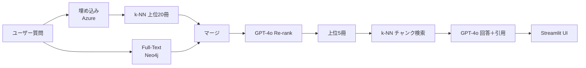

# DigitalGov-RAG-PoC
> デジタル庁『デジタル社会推進標準ガイドライン』を対象とした Retrieval‑Augmented QA プロトタイプ  
> **スタック = Azure GPT‑4o / GPT‑40‑mini + Neo4j（Vector & Full‑Text）+ Langfuse + Streamlit**

---

## 📜 プロジェクトの目的

マニュアルを **指定せず** に質問しても、非熟練者が正確かつ引用付きの回答を得られる仕組みを構築します。  
アーキテクチャは 2 段構え：

1. **Manual‑Filtering Agent** – 約 50 冊の PDF から関連上位 ≤ 5 冊へ絞り込み  
2. **RAG Answering** – その冊子内でチャンク検索し、GPT‑4o が最終回答を生成

本 PoC では **M0〜M3** をカバーします（ロードマップ参照）。

---

## 👥 チーム & 役割

| 役割 | 名前 | 担当 |
|------|------|------|
| 🏰 **プロジェクトリード** | **リー**（ChatGPT） | 全体設計・技術選定・ドキュメント |
| 🤖 **実装支援** | GitHub Copilot | コード足場・テスト雛形・リファクタ提案 |
| 🛠️ **ハンズオン開発** | **ゆうと** | データ取得・秘密情報管理・実行環境整備 |

---

## 🚩 ロードマップ概要（2025‑07）

| フェーズ | ゴール | 主な成果物 |
|---------|--------|-----------|
| **M0** | Hello Neo4j | Docker 構成 / ミニデータロード / 1‑shot QA / Langfuse トレース |
| **M1** | 前処理パイプライン | 50 PDF 取得 → チャンク → 要約 → Embedding → Neo4j |
| **M2** | Manual‑Filter Agent | k‑NN + FT Boost + GPT‑4o Re‑rank / Recall@5 評価 |
| **M3** | End‑to‑End RAG | Streamlit デモ UI / Nightly RAGAS 評価 / ダッシュボード |

---

## 🏗️ アーキテクチャ概要


---

## 🗄️ データソース

**デジタル庁「デジタル社会推進標準ガイドライン」**  
*約 30–50 冊、1 冊 200–1000 頁、明確な「第◯章」見出し、政府著作物（パブリックドメイン）*

### クイックスクレイパー

```bash
python data_pipeline/scraper.py   # PDF/ZIP を data/raw/ へ一括 DL
```

---

## 🛠️ 技術スタック

| レイヤ | ツール |
|-------|-------|
| LLM API | Azure GPT‑4o・GPT‑40‑mini |
| Embedding | Azure `text‑embedding‑3‑large` |
| Vector DB | Neo4j 5.13（HNSW cosine） |
| キーワード検索 | Neo4j Full‑Text (`japanese` analyzer) |
| オーケストレーション | Python + Langfuse Spans |
| UI | Streamlit |
| 評価 | RAGAS (GitHub Actions Nightly) |

---

## 📁 リポジトリ構成（予定）

```text
.
├── data_pipeline/
│   ├── scraper.py          # PDF/ZIP ダウンロード
│   ├── preprocess.py       # チャンク化・要約・埋め込み
│   └── loader.py           # Neo4j へロード
├── agents/
│   └── manual_filter.py    # Stage-1 絞り込み
├── retriever/
│   └── neo4j_search.py     # Stage-2 チャンク検索
├── app/
│   └── streamlit_app.py    # QA 用 UI
├── eval/
│   ├── goldset.csv         # 133 問 + 正解ラベル
│   └── ragas_runner.py
├── infra/
│   └── docker-compose.yml  # Neo4j + Langfuse
└── README.md
```

---

## 🚀 クイックスタート

```bash
# 1. サービス起動
cd infra && docker-compose up -d

# 2. サンプル PDF（3冊）を取得
python data_pipeline/scraper.py --limit 3

# 3. 前処理 & ロード
python data_pipeline/preprocess.py --input data/raw --neo4j bolt://localhost:7687

# 4. ワンショット QA
python mini_qa.py "行政手続きに関するBPRの定義とは？"
```

Azure キーは `.env` に保存（Git 管理対象外）。

---

## 🔄 開発フロー

1. フィーチャーブランチを作成  
2. **Copilot** にスキャフォールドを任せ、ロジックを仕上げる  
3. プッシュ → GitHub Actions で lint & unit test  
4. PR レビュー（リー）→ マージ → Nightly 評価

---

## ✅ 評価指標

- **Recall@5（Manual‑filter）** – 目標 ≥ 0.95  
- **Exact Match / Faithfulness（RAGAS）** – Nightly で監視  
- レイテンシ／トークンコスト – Langfuse ダッシュボード

---

## ⚖️ ライセンス

コード：MIT  
ドキュメント：デジタル庁発行物（政府著作物、パブリックドメイン）

---

> _“章の海原で迷う者を導く灯台となる。”_ – リー
